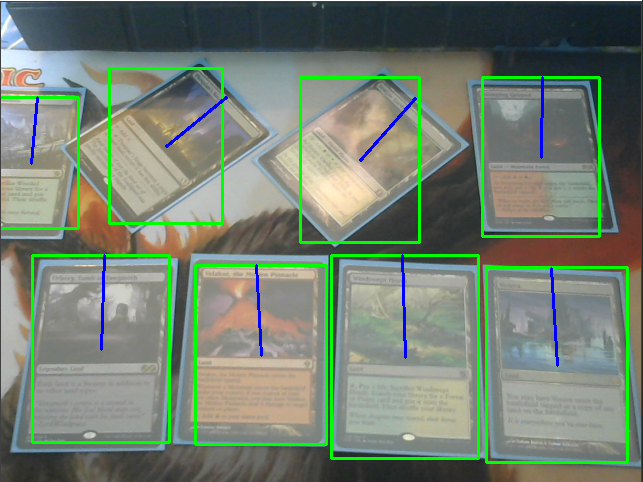
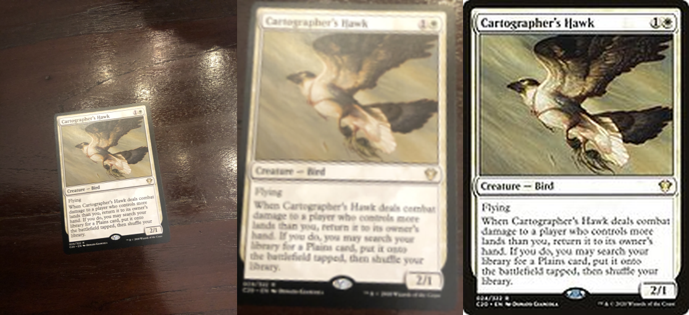
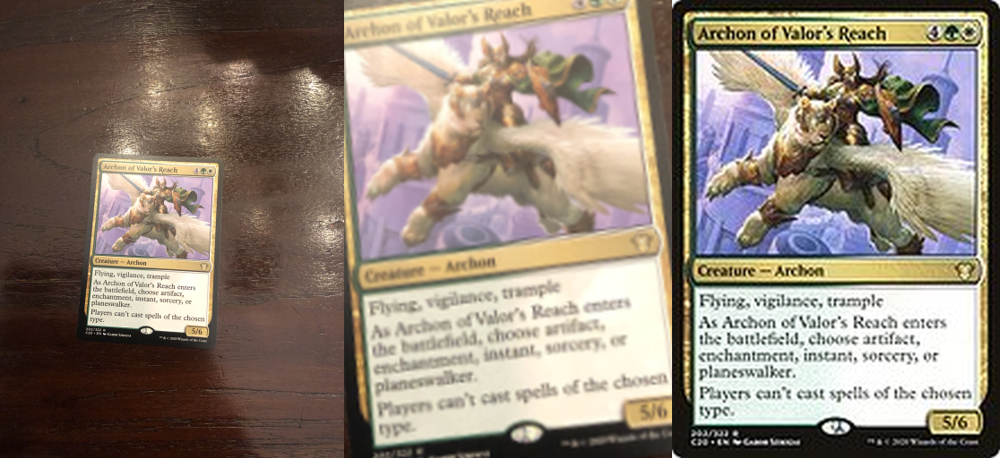
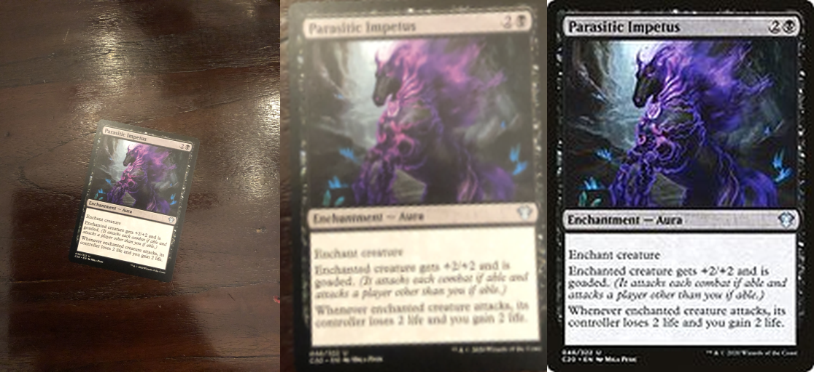

# MTG card scanner

<!-- About the project -->
## Getting Started

The goal of this project is to detect and subsequently classify Magic The Gathering cards from images using deep learning. The task is divided into two main tasks: (1) object detection, and (2) image recognition. For the former the general object detection framework proposed in a recent paper 'Objects as Points' by Zhou et al. [1] is used.
Image recognition is done using the approach formulated by Schroff et al. [2] (Facenet).

Below is an example of the object detection for a webcam with a resolution of 480x640. Green rectangles show the predicted width and height of the
cards, and the blue line the predicted orientation.



Each of the detected cards can be individually classified. The following example images show several testing images on the left, the detected cards extracted from the original image in the middle,
and on the right the assigned card.





Obtaining an accurate assessment of the performance and ability to generalise is difficult because of the lack labelled datasets. A small test dataset was created using 81 cards
of the preconstructed deck 'symbiotic swarm', three of these test images and their predictions are shown above. The accuracy is calculated as the fraction of cards whose name
was correctly predicted. For this test dataset an accuracy of 0.988 was achieved, meaning that for only one image it did not correctly assign the correct name. Note that this accuracy metric does not care about the set of the card.

## Dependencies

The project was run and tested using python 3.7.6. The required dependencies can be installed using the requirements.txt file. An example of settup up an environment with the correct dependencies and versions using Conda:

```sh
conda create -n "test_project" python=3.7.6 ipython
conda activate test_project
conda install pip

pip install -r requirements.txt
```

As an addition it is highly advised to install [tensorflow GPU](https://www.tensorflow.org/install/gpu) support.

## Dataset
The [scryfall api](https://scryfall.com/docs/api) was used to obtain images of all the MTG cards. Scryfall has several bulk data files containing a different number of cards. The 'Default Cards' file was used to obtain approximately 58.000 images of cards. This json file should be located at images/*Default_cards*.json, and the images at images/scryfall/.

Other datasets used for training/testing the object detection model and testing the recognition model should be located in the data/ folder, but are not yet available.

## Usage
The demo.py file contains several functions demonstrating the possible usages using the object detector and recognition models. In addition, below is a short example of how to use the object detector in your own code. Run the following snippet from the src directory:

```python
import _init_paths
import object_detection.object_detection as obj
import utils.util as util

import cv2 as cv

dim = (512,384)

model = obj.object_detection_model(dim)
model.load_weights('obj_detection_2')

filename = PATHTOFILE
img = cv.imread(filename)

[resized_img,pred] = model.get_predictions(img)
bbs = obj.get_boundingboxes(pred,dim)

util.draw_bbs(resized_img,bbs)
util.show_img(resized_img)
```

Next is a similar example of how to use the recognition model. A trained model is coupled with a fixed feature vector size and a file containing the precomputed feature vectors. The model weights are stored in models/weights/*weight_file_name*.h5, and the precomputed features in data/recognition_features/*weight_file_name*/. Note that this example requires the scryfall images dataset to visualise the predicted image.

```python
import _init_paths
import card_recognition.card_recognition as rec
import utils.util as util

import cv2 as cv

model = rec.card_recognition_model(feat_vec_size=256)
model.load_pred_arrays('img_recognition_4_1')#also loads weights

filename = PATHTOFILE
img = cv.imread(filename)

pred_image = model.predict_image(img)
util.show_img(pred_image)
```

## Pros / Cons
A short section about the pros and cons which should hint at possible use cases and further improvements.

### Pros
* Can detect multiple cards from a single image.
* Does not require a uniform background.
* Recognition robust to translation, rotation, and scale changes.
* Detection time independent of number of cards.

### Cons
* Cannot reliably predict the correct set.
* Data augmentation for recognition is not covering possible reflections on sleeves.
* Performance in general is limited by the small amount of training data.
* Test time for recognition scales linearly with number of cards in the image.


## References
* [1] Zhou, X., Wang, D., & Krähenbühl, P. (2019). Objects as points. arXiv preprint arXiv:1904.07850.
* [2] Schroff, F., Kalenichenko, D., & Philbin, J. (2015). Facenet: A unified embedding for face recognition and clustering. In Proceedings of the IEEE conference on computer vision and pattern recognition (pp. 815-823).
